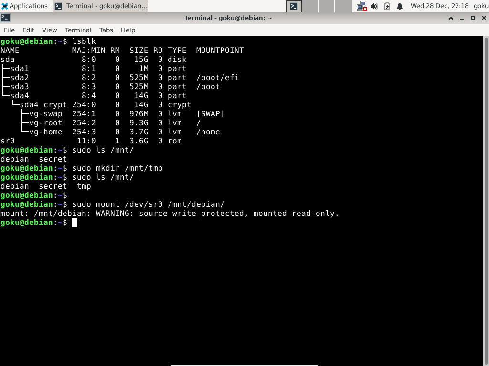

# Extras:

## Using a USB stick as a repository to install software offline.





## fsck settings.


## Disk encryption. 

## Recovery options for a broken configuration.


Download Ubuntu Desktop ISO image from: 

https://ubuntu.com/desktop

And boot up with it.

Choose **Try Ubuntu**. Open a terminal and 

```
	$ sudo cryptsetup luksOpen /dev/sdX4 debian

	$ sudo vgscan --mknodes

	$ sudo vgchange -ay

	$ sudo lvscan 

	$ sudo mount /dev/vg/root /mnt

	$ sudo mount /dev/vg/home /mnt/home

	$ sudo mount /dev/sdX3 /mnt/boot

	$ sudo mount /dev/sdX2 /mnt/boot/efi

	$ sudo mount -o bind /proc /mnt/proc
	
	$ sudo mount -o bind /sys /mnt/sys
	
	$ sudo mount -o bind /dev /mnt/dev

```

```
	$ sudo chroot /mnt  /bin/bash 
	
	# source /etc/profile
```

## Misc.
