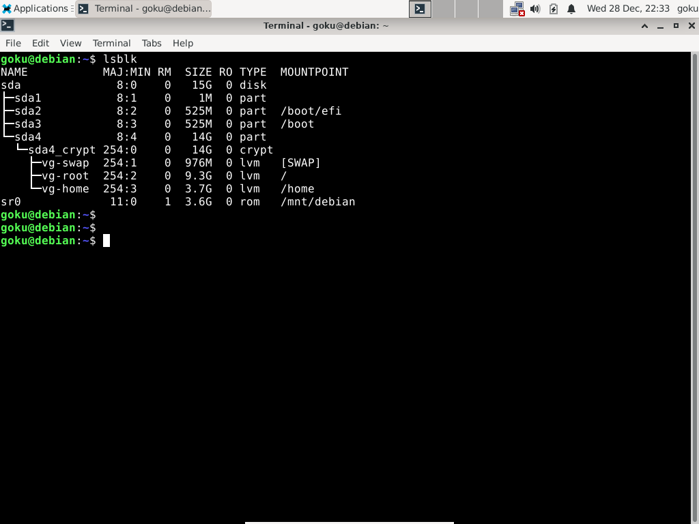

# Working...
# Extras:

## Using a USB stick as a repository to install software offline.


## fsck settings.




## Disk encryption. 

## Recovery options for a broken configuration.


http://www.slackware.com/

http://www.slackware.com/getslack/


https://slackware.uk/slackware/


```
	# cryptsetup luksOpen /dev/sdX4 debian

	# vgscan --mknodes

	# vgchange -ay

	# lvscan 

	# mount /dev/vg/root /mnt

	# mount /dev/vg/home /mnt/home

	# mount /dev/sdX3 /mnt/boot

	# mount /dev/sdX2 /mnt/boot/efi

	# mount -o bind /proc /mnt/proc
	
	# mount -o bind /sys /mnt/sys
	
	# mount -o bind /dev /mnt/dev

```

```
	# chroot /mnt
```

## Misc.
